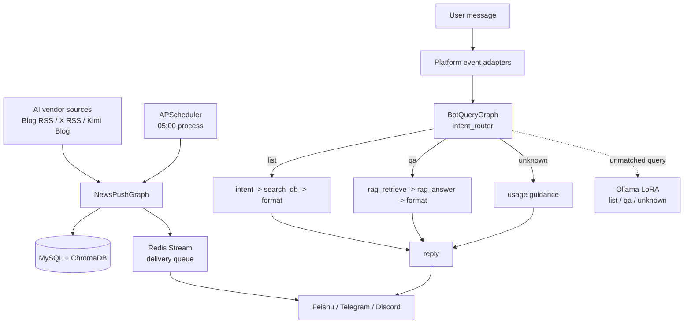

# NewsPilot

NewsPilot 是一个面向 AI 行业资讯的多平台新闻推送与问答 Bot。它定时抓取 AI 厂商的 Blog RSS、X/Twitter RSS 和 Kimi Blog 内容，经大模型提炼后推送到 Feishu、Telegram 和 Discord；用户也可以查询近期新闻，或基于已收录文章进行问答。

> 当前项目定位：AI 新闻 `list`、新闻 `qa`，以及对无关问题返回使用引导。

<p align="center">
  
  
  
  
</p>

## Features

- AI 新闻聚合：覆盖 OpenAI、Anthropic、Google DeepMind、DeepSeek、Kimi (Moonshot)、Z.ai / 智谱等厂商。
- 定时处理与推送：每天 05:00 抓取、总结并入库，按用户偏好在 09:00、12:00、18:00 投递。
- 三平台接入：Feishu WebSocket、Telegram Webhook、Discord Gateway。
- 新闻列表查询：按厂商和时间范围查询 MySQL 中的已收录新闻。
- 新闻问答：使用 ChromaDB 检索相关文章，再由 LLM 生成带来源的回答。
- 三分类意图识别：明确规则优先；未命中时调用可选的本地 Ollama LoRA 模型；异常或低置信度进入 `unknown`。
- 订阅管理：支持按厂商订阅、退订、推送时间和推送频率设置。
- 可靠性与可观测性：Redis 缓存与投递队列、LLM 熔断、结构化日志、Prometheus 指标和 Grafana 看板。

## Architecture



项目使用两条 LangGraph 工作流：

- `NewsPushGraph`：`extract -> summarize -> store -> build_card -> send`。凌晨预处理时跳过建卡和发送，投递阶段由 Redis Stream 消费者完成。
- `BotQueryGraph`：`intent_router` 根据 `list`、`qa`、`unknown` 进行条件路由。`unknown` 不访问 MySQL 或 ChromaDB，只返回新闻 Bot 使用引导。

完整节点图和状态说明见 [`docs/langgraph-workflows.md`](docs/langgraph-workflows.md)。

## Quick Start

### Prerequisites

- Python 3.10+
- MySQL 8.0+
- Redis 6.0+（Docker Compose 使用 Redis 7）
- 至少一个平台的 Bot 凭证
- 一个可用的 LLM API Key，用于新闻总结和 RAG 问答
- `OPENAI_API_KEY`，用于 ChromaDB 的文章与查询 Embedding（即使 `LLM_PROVIDER` 不是 `openai` 也需要）

本地意图模型是可选依赖。启用它还需要运行 Ollama，并创建名为 `newpilot-intent` 的模型。模型训练与部署文件位于独立的 `D:\HuggingFaceModel` 目录，不随本项目提交。

### Configure

```bash
git clone <repository-url>
cd NewsPilot
cp .env.example .env
```

至少配置平台凭证、LLM、`OPENAI_API_KEY` 和数据库连接。意图模型相关配置如下：

```env
# LLM provider: openai | anthropic | deepseek
LLM_PROVIDER=openai
OPENAI_API_KEY=your_api_key

# Optional local intent classifier
INTENT_OLLAMA_ENABLED=false
INTENT_OLLAMA_URL=http://127.0.0.1:11434
INTENT_OLLAMA_MODEL=newpilot-intent
INTENT_CONFIDENCE_THRESHOLD=0.75
INTENT_OLLAMA_TIMEOUT_SECONDS=5
```

规则命中时不会调用 Ollama。只有规则未命中的消息才会请求本地模型；模型关闭、不可用、输出格式错误或置信度低于阈值时，最终意图为 `unknown`。

### Run Locally

```bash
pip install -r requirements.txt
uvicorn app.main:app --host 0.0.0.0 --port 8000 --reload
```

生产或可复现安装使用锁定依赖：

```bash
pip install -r requirements-lock.txt
```

### Run with Docker Compose

```bash
docker compose up -d --build
```

该命令启动 NewsPilot、MySQL、Redis、Prometheus 和 Grafana。Docker 容器内访问宿主机 Ollama 时，将 `INTENT_OLLAMA_URL` 设置为 `http://host.docker.internal:11434`，并确保 Ollama 接受来自容器的连接。

### Verify

```bash
curl http://localhost:8000/health
curl http://localhost:8000/health/detailed
curl http://localhost:8000/metrics
```

## Usage

自然语言查询示例：

| Intent | Example |
| --- | --- |
| `list` | `OpenAI 最近有什么新闻？` |
| `list` | `列出最近三天 DeepSeek 的动态` |
| `qa` | `OpenAI 最近为什么调整 API？` |
| `qa` | `这次发布对开发者有什么影响？` |
| `unknown` | `帮我写一个 Python 爬虫` |

各平台命令：

| Action | Feishu | Telegram | Discord |
| --- | --- | --- | --- |
| Subscribe | `@Bot 订阅 OpenAI` | `/subscribe OpenAI` | `@Bot 订阅 OpenAI` |
| Unsubscribe | `@Bot 退订 OpenAI` | `/unsubscribe OpenAI` | `@Bot 退订 OpenAI` |
| Subscriptions | `@Bot 订阅列表` | `/list` | `@Bot 订阅列表` |
| Settings | `@Bot 设置` | `/settings` | `@Bot 设置` |
| Help | `@Bot 帮助` | `/help` | `@Bot 帮助` |

Discord 消息需要 `@mention` Bot。首次加入群聊时会自动注册会话并订阅全部厂商；Telegram 和 Feishu 会根据运行时事件自动发现会话。

## API and Monitoring

| Endpoint | Method | Purpose |
| --- | --- | --- |
| `/health` | GET | Basic health check |
| `/health/detailed` | GET | MySQL、Redis 和熔断器状态 |
| `/metrics` | GET | Prometheus metrics |
| `/webhook/telegram` | POST | Telegram webhook |
| `/admin/trigger-rss` | POST | 手动执行抓取、总结和入库 |
| `/admin/trigger-push` | POST | 手动触发指定时间窗口的投递 |
| `/admin/backfill-chromadb` | POST | 将已有文章补入向量库 |
| `/admin/test-card` | POST | 发送测试消息 |

所有 `/admin/*` 接口都要求 `X-Admin-Token`，未设置 `ADMIN_API_TOKEN` 时接口整体禁用。监控服务地址：Prometheus `http://localhost:9090`，Grafana `http://localhost:3000`，默认登录信息为 `admin/admin`（可通过环境变量修改）。

## Project Structure

```text
NewsPilot/
├── app/
│   ├── main.py                 # FastAPI 入口、调度器和平台回调
│   ├── core/                   # 配置、缓存、限流、熔断、日志和指标
│   ├── platforms/              # Feishu、Telegram、Discord 适配器
│   ├── graph/                  # LangGraph 工作流、State 和节点
│   ├── intent/                 # Ollama 本地意图分类客户端
│   ├── fetcher/                # RSS、Kimi Blog 和网页正文抓取
│   ├── llm/                    # OpenAI、Anthropic、DeepSeek Provider
│   ├── rag/                    # Embedding 和 ChromaDB 向量检索
│   ├── db/                     # SQLAlchemy 模型、Redis 和 Repository
│   ├── queue/                  # Redis Stream 投递队列和消费者
│   ├── subscription/           # 订阅、退订和推送偏好
│   ├── chat/                   # 会话注册和权限管理
│   ├── feishu/                 # Feishu SDK、事件路由和卡片兼容逻辑
│   └── prompts/                # YAML Prompt 模板
├── tests/                      # pytest 测试，按功能组织
├── docs/
│   ├── adr/                    # Architecture Decision Records
│   └── langgraph-workflows.md  # LangGraph 节点与流程图
├── monitoring/                 # Prometheus 和 Grafana 配置
├── scripts/                    # 基准测试等工具脚本
├── docker-compose.yml          # 应用及基础设施编排
├── Dockerfile
├── .env.example
├── requirements.txt
├── requirements-lock.txt
└── CLAUDE.md                   # 详细开发上下文
```

## Development

```bash
# Full test suite
pytest -v

# Intent and query workflow tests
pytest -v tests/test_intent_router.py tests/test_ollama_classifier.py tests/test_bot_query_graph.py

# Tests by feature
pytest -v -k "telegram"
pytest -v -k "discord"

# Query throughput benchmark
python scripts/benchmark_query.py
```

代码使用 Python 3.10+、四空格缩进、类型标注和 `snake_case` 命名。新增业务逻辑应优先放入对应节点或领域模块，并为正常路径、失败降级路径和外部服务异常补充 pytest 测试。提交信息沿用 `feat:`、`fix:`、`chore:`、`docs:` 等简洁前缀。

## Documentation

- [`docs/langgraph-workflows.md`](docs/langgraph-workflows.md)：NewsPushGraph、BotQueryGraph 和三分类意图路由图。
- [`CLAUDE.md`](CLAUDE.md)：代码结构、运行约束、数据库和平台实现细节。
- [`docs/adr/`](docs/adr/)：架构决策记录。
- [`implementation-plan.md`](implementation-plan.md)：项目实现阶段和任务记录。
- [`AGENTS.md`](AGENTS.md)：贡献者与代码代理指南。

## Security

不要提交 `.env`、API Key、Bot Token、数据库密码或生成的 `chroma_data/`。启用管理接口前必须设置随机的 `ADMIN_API_TOKEN`。生产环境建议使用 `requirements-lock.txt`，并将 Prometheus、Grafana 和管理接口限制在可信网络内。

## License

MIT. See [`LICENSE`](LICENSE).
