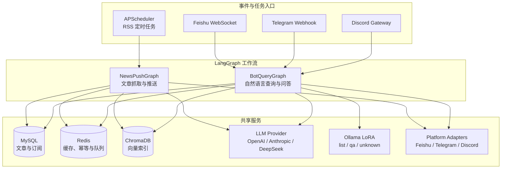
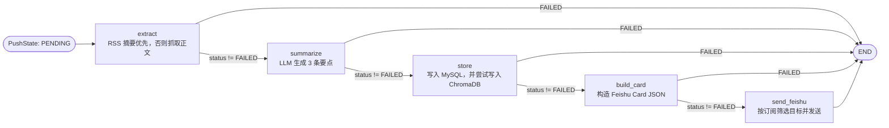
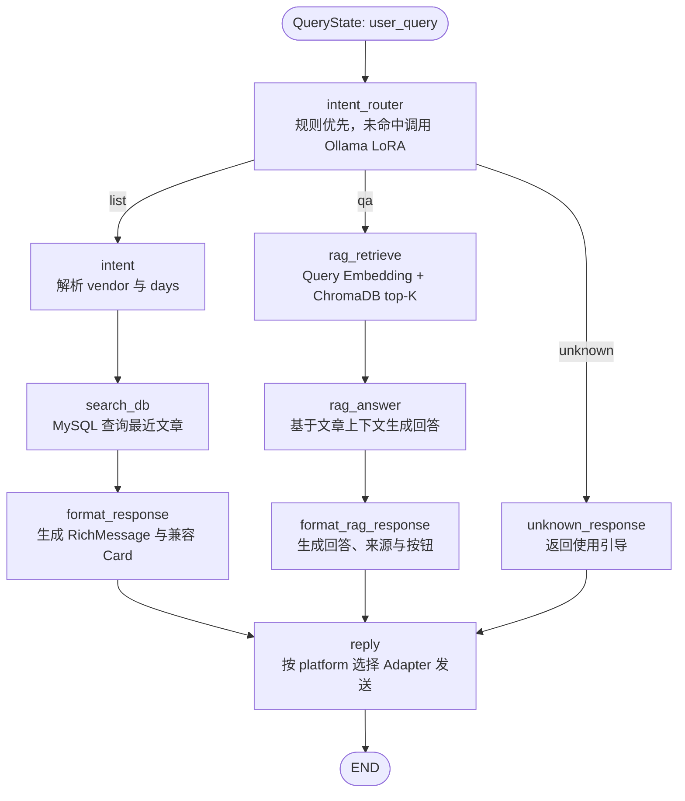

# LangGraph Workflow 架构

本文描述项目中两个 LangGraph 工作流的节点、状态流转、触发入口和外部依赖。工作流定义位于 `app/graph/`，状态模型位于 `app/graph/state.py`。

## 1. 总体架构

订阅、帮助、设置等命令在事件路由层直接处理，不进入 `BotQueryGraph`。只有自然语言查询会构造 `QueryState` 并调用 `graph.invoke(state)`。

## 2. NewsPushGraph

入口是 `app/main.py::process_rss_job`，每篇未处理文章创建一个 `PushState`。默认完整推送模式的流程如下：

`build_push_graph(push_enabled=False)` 用于预处理，只执行 `extract -> summarize -> store -> END`。启用 `enable_checkpoint=True` 时使用 `MemorySaver`；启用 `enable_human_review=True` 时会在 `send_feishu` 前中断，等待人工恢复。

## 3. BotQueryGraph

查询状态为 `QueryState`，入口节点 `intent_router` 将用户输入分为 `list`、`qa` 或 `unknown`。意图识别采用简单的两级策略：先检查明确的 AI 新闻关键词和查询信号；未命中时再调用可选的本地 Ollama LoRA 小模型。模型关闭、调用异常、JSON 格式无效或置信度低于 `0.75` 时统一进入 `unknown`。

`list` 用于查询 AI 新闻、最新动态或新闻列表；`qa` 用于针对 AI 新闻或文章内容提问、解释和分析。`unknown` 只执行 `unknown_response`，返回新闻 Bot 使用引导，不进入 MySQL 查询或 ChromaDB 检索。

RAG 检索结果为空时生成友好兜底回复；LLM 熔断或调用失败时返回检索到的文章列表，避免整个查询失败。`reply` 统一消费 `rich_message`，并根据 `platform` 选择对应适配器。

### 3.1 意图识别状态

| 字段 | 含义 |
|------|------|
| `query_type` | 最终路由：`list`、`qa` 或 `unknown` |
| `intent_confidence` | 规则命中为 `1.0`；模型结果为模型返回值；失败时为 `0.0` |
| `intent_source` | `rule`、`ollama` 或具体失败原因，如 `ollama_error`、`ollama_low_confidence` |

Ollama 配置位于 `.env`：`INTENT_OLLAMA_ENABLED`、`INTENT_OLLAMA_URL`、`INTENT_OLLAMA_MODEL`、`INTENT_CONFIDENCE_THRESHOLD` 和 `INTENT_OLLAMA_TIMEOUT_SECONDS`。默认关闭本地模型；完成模型创建和离线验证后，设置 `INTENT_OLLAMA_ENABLED=true`。

## 4. 状态与扩展约束

- `PushState` 负责在抓取、摘要、持久化、卡片和发送节点之间传递文章数据及 `status`。
- `QueryState` 负责传递用户信息、路由结果、数据库结果、RAG 上下文和最终消息。
- 新增节点时应明确读写哪些 State 字段，并在图构建函数中注册边；失败场景应设置 `status` 或提供可见的降级结果。
- 外部服务调用应沿用现有缓存、熔断、重试和指标埋点模式。

## 5. 相关代码与测试

- `app/graph/news_push_graph.py`
- `app/graph/bot_query_graph.py`
- `app/graph/nodes/intent_router.py`
- `app/graph/nodes/unknown_response.py`
- `app/graph/state.py`
- `app/intent/ollama_classifier.py`
- `tests/test_news_push_graph.py`
- `tests/test_bot_query_graph.py`
- `tests/test_intent_router.py`
- `tests/test_ollama_classifier.py`
- `tests/test_integration.py`

运行 `pytest -v tests/test_intent_router.py tests/test_ollama_classifier.py tests/test_bot_query_graph.py` 可验证三分类路由、Ollama 响应解析和 `unknown` 图路径；运行 `pytest -v -k "graph or integration"` 可验证图编译和主要集成路径。
